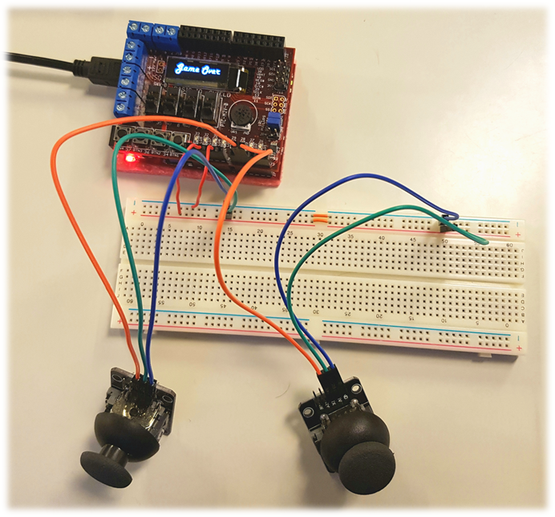

KTH-IS1200: Game project for the chipKIT™ Uno32. *Kozmoz* is inspired by *Space Invaders*, with the same basic gameplay (the player controls a ship traversing the x-axis at the bottom of the screen and must shoot down incoming waves of enemies). More detailed information can be found in the Extended Abstract.

## Explanation of files & folders
* **README.md** - this document.
* **connection.png** - image of the joysticks connected to the chipKIT™ Uno32.
* **graphics.zip** - image files for those graphics that cover the entire screen. These image files were converted to bitmaps for use in the code using an [online converter](http://www.majer.ch/lcd/adf_bitmap.php).
* **logo.png** - snazzy game logo.

## Setup
The [mcb32tools](https://github.com/is1200-example-projects/mcb32tools) are used compiling and running the code. The external components (e.g. the joysticks), are connected as in the image below.

## Components used
ChipKIT™ components
* [chipKIT™ Uno32 by Digilent](http://chipkit.net/wpcproduct/chipkit-uno32/)
* [Basic I/O Shield](http://chipkit.net/wpcproduct/chipkit-basic-io-shield/)

External components
* 2x [Luxorparts Joystick](https://www.kjell.com/se/sortiment/el-verktyg/arduino/moduler/luxorparts-joystick-modul-for-arduino-p87943) (movement)

Coupling
* 6x [Luxorparts Divisible Coupling Cable](https://www.kjell.com/se/sortiment/el-verktyg/arduino/tillbehor/luxorparts-delbar-kopplingskabel-40-pol-hane-hane-p87901)
* 4x [Luxorparts Coupling Wire](https://www.kjell.com/se/sortiment/el-verktyg/verktyg/matinstrument/matsladdar-prober-kontakter/kopplingstrad/luxorparts-kopplingstrad-120-st-p87395)
* [Luxorparts Breadboard (840 connections)](https://www.electrokit.com/produkt/kopplingsdack-840-anslutningar/?gclid=Cj0KCQiAk-7jBRD9ARIsAEy8mh4qjp4SOr5r_NmhHSzrhE4ZWotySDBRuwqDkEEMemIxBAO8purGmw4aAnTtEALw_wcB)
